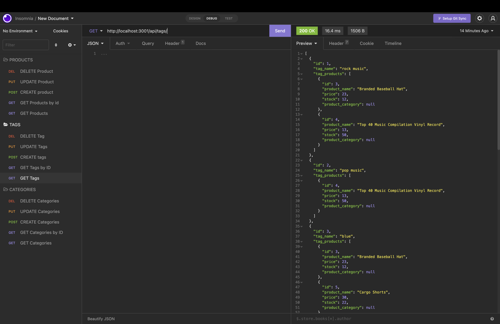

# E-A-Commerce-itsinthegame

## Description

    This project displays the application's ability to pull data from the sql databases. Through several routes, seeds, and models, this back-end e-commerce databse is able to be accessed and displayed in the Insomnia applicaiton.

## Table of Contents

- [Usage](#usage)

- [Contributing](#contributing)

- [Tests](#tests)

- [Questions](#questions)

- [Links](#links)

## "Baby got back" - Sir Mix-a-Lot

    This application requires a mySql databse to be created, along with the "npm run seed" command before starting up the server. This project was especially tricky because the only way to tell if it was not working was after it was all finished.

## Contributing

    Me, professors, and Brandon Rose

## Questions

    Github username: Sean-Lee-17

## Links

- [Github](https://github.com/SeanLee-17/E-A-Commerce-itsinthegame)
- [Live Website](https://git.heroku.com/fierce-fjord-14191.git)

## Screenshot

